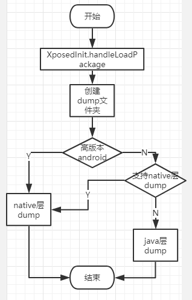
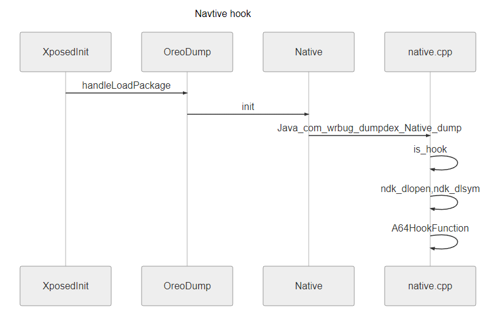
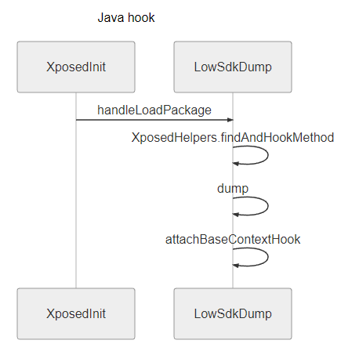

# Android逆向之路---脱壳360加固原理解析

## 前言

众所周知，上次说到了如何脱壳360加固，大致意思就是安装一个xposed插件，然后自动就会脱壳了，那么这个插件是如何工作的呢，本次重点说说这个。
上次说道了dumpDex脱壳360加固，其实先说个大概，就是从ndk层和java层，适配不同的系统，hook关键函数，然后在运行时将dex文件dump出来。
如果仅仅想知道如何使用，可以参见上一篇

[点我：Android逆向之路---脱壳360加固、与xposed hook注意事项](http://martinhan.site/2018-12-13/Android%E9%80%86%E5%90%91%E4%B9%8B%E8%B7%AF---%E8%84%B1%E5%A3%B3360%E5%8A%A0%E5%9B%BA%E3%80%81%E4%B8%8Exposed%20hook%E6%B3%A8%E6%84%8F%E4%BA%8B%E9%A1%B9.html)

dumpDex github项目地址：[点我点我、dumpDex](https://github.com/WrBug/dumpDex)


## 需要的环境

* 无，看文章就可以了解大致了
(当然你要是想编译下dumpDex项目，需要如下工具)

*  Android Studio
*  sdk ndk

## 入口

所有的程序执行的时候都是有个入口的，dumpDex工程也不例外。 由于是个xposed插件，所以我们先看`com.wrbug.dumpdex.XposedInit`类。


``` java
public class XposedInit implements IXposedHookLoadPackage {

    //--------略---------

    @Override
    public void handleLoadPackage(final XC_LoadPackage.LoadPackageParam lpparam) {
        PackerInfo.Type type = PackerInfo.find(lpparam);
        if (type == null) {
            return;
        }
        final String packageName = lpparam.packageName;
        //这里主要是各个app只管解析各个app自己的进程的程序
        if (lpparam.packageName.equals(packageName)) {
            //首先在当前app的指定目录，创建好目录，以便于一会儿脱壳存放dex文件
            String path = "/data/data/" + packageName + "/dump";
            File parent = new File(path);
            if (!parent.exists() || !parent.isDirectory()) {
                parent.mkdirs();
            }
            log("sdk version:" + Build.VERSION.SDK_INT);
            
            if (DeviceUtils.isOreo()) {
                //api为27或27版本的执行下面一行，进行脱壳
                OreoDump.init(lpparam);
            } else {
                //低版本api执行下面一行进行脱壳
                LowSdkDump.init(lpparam,type);
            }

        }
    }
}

```


已经加好注释，值得注意的就是，此处程序有分叉了，分别是 OreoDump.init()和LowSdkDump.init() 我们先看OreoDump.init方法

``` java
public class OreoDump {

    //--------略---------

    public static void init(final XC_LoadPackage.LoadPackageParam lpparam) {
        Native.dump(lpparam.packageName);
    }
}

```

跟着进入Native.dump(),

* 注：不会android ndk也没关系，可以继续往下看

## Native hook

以下可以先粗略的说一下，主要就是进入了ndk层进行hook，然后进行dump
进入`native.cpp`文件里面找到`JNICALL Java_com_wrbug_dumpdex_Native_dump`方法。
由于切换到了c语言，所以我会帮大家删除一些代码的细枝末节，只看主干。
再次声明下，以下方法实在当android版本为26或27的时候，会默认进行Native层脱壳

``` cpp
JNIEXPORT void JNICALL Java_com_wrbug_dumpdex_Native_dump
        (JNIEnv *env, jclass obj, jstring packageName) {

    //在这里作者考虑到了防止每次app启动的时候都会dump，因此保存了一个变量is_hook来记录，如果hook过了的话就会退出程序
    static bool is_hook = false;
    char *p = (char *) env->GetStringUTFChars(packageName, 0);
    if (is_hook) {
        __android_log_print(ANDROID_LOG_INFO, TAG, "hooked ignore");
        return;
    }
    init_package_name(p);
    env->ReleaseStringChars(packageName, (const jchar *) p);
    

    //这里由于使用了第三方库，所以先执行第三方库的初始化操作，具体第三方库，见下文  
    ndk_init(env);
    
    //下面就是重点了，首先以RTLD_NOW模式打开动态库libart.so，拿到句柄
    void *handle = ndk_dlopen("libart.so", RTLD_NOW);
    if (handle == NULL) {
        __android_log_print(ANDROID_LOG_ERROR, TAG, "Error: unable to find the SO : libart.so");
        return;
    }
    //根据不同的版本，拿到不同的对应的加载的符号
    void *open_common_addr = ndk_dlsym(handle, get_open_function_flag());

    //--------略---------
    //略掉很多分支，单独说一个,见下文
    if (registerInlineHook((uint32_t) open_common_addr, (uint32_t) get_new_open_function_addr(),
                           (uint32_t **) get_old_open_function_addr()) != ELE7EN_OK) {
        __android_log_print(ANDROID_LOG_ERROR, TAG, "register1 hook failed!");
        return;
    } else {
        __android_log_print(ANDROID_LOG_ERROR, TAG, "register1 hook success!");
    }
    //设置hook标记为true
    is_hook = true;
}

```


``` cpp
registerInlineHook(
    (uint32_t) open_common_addr, (uint32_t) get_new_open_function_addr(),
                           (uint32_t **) get_old_open_function_addr())

```

已经定位到函数的地址，接下来就是Hook替换以前的函数，替换成我们自己定义的函数，例如下面的函数

``` c
static void *new_arm64_open_common(uint8_t *base, size_t size, void *location,
                                   uint32_t location_checksum, void *oat_dex_file,
                                   bool verify,
                                   bool verify_checksum,
                                   void *error_meessage, void *verify_result) {
    //--------略---------
    //首先在程序运行时，保存dex，完成脱壳
    save_dex_file(base, size);
    //调用以前的函数，保证程序正确执行，
    void *result = old_arm64_open_common(base, size, location, location_checksum,
                                        oat_dex_file, verify, verify_checksum,
                                        error_meessage,
                                        verify_result);
    return result;
}

```

## NDK层hook完毕

到此为止NDK层hook分析完毕，分别用了第三方库hook了android指定版本的加载dex函数的方法，然后在hook的新函数里面添加到保存到dump目录的函数，达到脱壳 的目的。

ndk hook主要用到的库

https://github.com/Rprop/ndk_dlopen
https://github.com/ele7enxxh/Android-Inline-Hook


## SDK层hook

回到入口的那个章节，还记得吗，还有一个`LowSdkDump.init` 这个是低版本的时候的逻辑

``` java
public static void init(final XC_LoadPackage.LoadPackageParam lpparam, PackerInfo.Type type) {
        //如果sdk是23,24,25,26,27之一，那么继续使用native层hook
        if (DeviceUtils.supportNativeHook()) {
            Native.dump(lpparam.packageName);
        }
        //额。。。。。。。。可能百度充钱了
        if (type == PackerInfo.Type.BAI_DU) {
            return;
        }
        //见下文说明
        XposedHelpers.findAndHookMethod("android.app.Instrumentation", lpparam.classLoader, "newApplication", ClassLoader.class, String.class, Context.class, new XC_MethodHook() {
            @Override
            protected void afterHookedMethod(MethodHookParam param) throws Throwable {
                //执行真正的dump方法，然后保存
                dump(lpparam.packageName, param.getResult().getClass());
                attachBaseContextHook(lpparam, ((Application) param.getResult()));
            }
        });
    }
```

上面的主要就是先检测可不可以natvie层hook，可以的话优先native层hook，
然后就是百度可能充钱了，当然开个玩笑，这个可以大家自己尝试。
接下来就是java层hook了，hook了加载类Instrumentation类，的newApplication方法，然后进行dump.
还有attachBaseContextHook里面也是主要Hook  ClassLoader的loadClass方法，
主要看java层的dump函数

``` java
private static void dump(String packageName, Class<?> aClass) {
        Object dexCache = XposedHelpers.getObjectField(aClass, "dexCache");
        log("decCache=" + dexCache);
        Object o = XposedHelpers.callMethod(dexCache, "getDex");
        byte[] bytes = (byte[]) XposedHelpers.callMethod(o, "getBytes");
        String path = "/data/data/" + packageName + "/dump";
        File file = new File(path, "source-" + bytes.length + ".dex");
        if (file.exists()) {
            log(file.getName() + " exists");
            return;
        }
        FileUtils.writeByteToFile(bytes, file.getAbsolutePath());
    }

```


## 大功告成

代码陆陆续续的看了一遍，可以尝试画一个流程图了







## 后记

其实文中涉及到的具体的hook的函数，需要我们具体的去看,去研读android源码。
这样才能融汇贯通。
了解了系统是如何加载一个dex的，才能真真正正的理解如何拦截，如何从内存dump出来。
dump的时候用的别人的库，的工具，都还好，主要是思路。如何找到关键点，进行dump。
如何使用呢，可以见我的的上一篇文章
点我：[Android逆向之路---脱壳360加固、与xposed hook注意事项](http://martinhan.site/2018-12-13/Android%E9%80%86%E5%90%91%E4%B9%8B%E8%B7%AF---%E8%84%B1%E5%A3%B3360%E5%8A%A0%E5%9B%BA%E3%80%81%E4%B8%8Exposed%20hook%E6%B3%A8%E6%84%8F%E4%BA%8B%E9%A1%B9.html)


